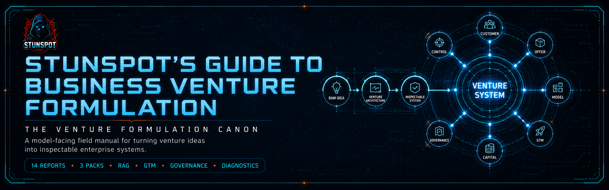

<p align="center">
  
</p>

# Stunspot's Guide to Business Venture Formulation

**The Venture Formulation Canon**  
*A model-facing field manual for turning venture ideas into inspectable enterprise systems.*


[](https://doi.org/10.5281/zenodo.21039191)

*Stunspot's Guide to Business Venture Formulation* is a Markdown-native knowledge repository built primarily for AI-assisted venture analysis, founder reasoning, strategic design, and RAG/long-context use.

Its main audience is the model.

When loaded into an AI workspace, project knowledge base, RAG pipeline, long-context session, or agent memory layer, the Guide functions as a dense venture-formulation substrate: it gives the assisting model a stable vocabulary for analyzing ventures as systems of value creation, value capture, coordination, resource conversion, market power, demand formation, commercial motion, governance, institutional legitimacy, diagnostics, measurement, and execution control.

Human readers can use it as a serious field manual, but the repository is not optimized as a consumer-friendly startup course. It is intended to make AI systems better at helping founders, operators, investors, advisors, product strategists, and venture-builders reason through the actual architecture of an enterprise before enthusiasm, slogans, or spreadsheet theater take over the wheel.

At its core is a simple premise:

> A venture is not an idea, a product, or a pitch deck. It is a layered enterprise reality: a value-creation system, value-capture system, coordination system, resource-conversion mechanism, legitimacy-seeking institutional actor, and adaptive strategic actor operating under uncertainty.

Use it as reference material.  
Use it as RAG substrate.  
Use it as project knowledge.  
Use it as doctrine for AI agents tasked with venture critique, offer design, market analysis, governance review, diagnostic intervention, or business-model formulation.

Part of the Stunspot’s Guide to… Advanced Knowledge Base Library
Browse the full library: 
[Gateway Repo](https://github.com/Stunspot/stunspots-guides) · [stunspot.com](stunspot.com/#guides)

---

## Start Here

- [Canon Map](./docs/canon-map.md) — the report sequence, with a short explanation of what each report contributes.
- [How to Use This Canon](./docs/how-to-use-this-canon.md) — practical workflows for human readers and AI/RAG systems.
- [Knowledge Packs](./docs/knowledge-packs.md) — which upload format to use for different tools and retrieval styles.
- [Manifest](./MANIFEST.md) — release counts, source-to-output mappings, and repository file inventory.

---

## Corpus Shape

- **14 source reports** in [`knowledge-packs/by-report/`](./knowledge-packs/by-report/)
- **3 compiled packs** in [`knowledge-packs/compiled-packs/`](./knowledge-packs/compiled-packs/)
- **1 omnibus file** in [`knowledge-packs/omnibus/`](./knowledge-packs/omnibus/)

`docs/` is the navigation and public guidance layer. The individual source-report corpus lives in `knowledge-packs/by-report/`. Grouped upload packs live in `knowledge-packs/compiled-packs/`. The full-corpus bundle lives in `knowledge-packs/omnibus/`. This repository intentionally does **not** use `docs/reports/` for the report corpus.

---

## What This Canon Covers

The canon is organized across **3 compiled volumes** and **14 reports**, from **A** through **N**.

It covers:

- venture ontology, enterprise reality, and the difference between products, companies, coordination systems, and institutions
- operational epistemology, assumption architecture, validation logic, evidence quality, and decision thresholds under uncertainty
- market structure, strategic environment, competitive power, timing, and industry constraint
- customer reality, demand formation, opportunity intelligence, and revealed-preference discovery
- venture states, stage transitions, scaling logic, and stage-gated commitment
- offer architecture, positioning, category design, and market legibility
- business-model architecture, value capture, unit economics, and economic sustainability
- go-to-market architecture, commercial motion, acquisition economics, retention, expansion, and channel-model fit
- operating model design, delivery systems, capability architecture, and resource conversion
- capital strategy, resource assembly, financing logic, and strategic resourcing
- organizational design, stakeholder alignment, decision rights, and coordination mechanisms
- governance, legitimacy, compliance, institutional permission, and the right to operate
- venture diagnostics, failure modes, corrective intervention, and recovery logic
- execution control, measurement systems, review rhythms, institutional artifacts, and steering discipline

---

## Who This Is For

This canon is written for people and systems trying to formulate or evaluate real ventures:

- **founders** turning an idea into a coherent enterprise architecture
- **operators** translating strategy into systems, metrics, roles, and cadence
- **investors and advisors** assessing whether a venture is structurally viable rather than merely narratively attractive
- **product and GTM leaders** aligning customer reality, offer design, positioning, pricing, and commercial motion
- **AI/RAG builders** creating venture-analysis assistants, founder copilots, incubator knowledge systems, or strategy-review agents
- **consultants and venture studios** needing shared doctrine for repeatable business-design work
- **serious learners** who want a structured map of venture formulation instead of scattered startup folklore

---

## How To Read It

The canon can be read straight through, but most readers should enter through their problem.

### If you are testing whether a venture is real

Start with:

1. [A — Venture Ontology and Enterprise Reality](./knowledge-packs/by-report/a-venture-ontology-and-enterprise-reality.md)
2. [B — Operational Epistemology and Decision Logic](./knowledge-packs/by-report/b-operational-epistemology-and-decision-logic.md)
3. [D — Customer Reality, Demand Formation, and Opportunity Intelligence](./knowledge-packs/by-report/d-customer-reality-demand-formation-and-opportunity-intelligence.md)
4. [E — Venture States, Stage Transitions, and Scaling Logic](./knowledge-packs/by-report/e-venture-states-stage-transitions-and-scaling-logic.md)

### If you are shaping an offer and commercial motion

Start with:

1. [F — Offer Architecture, Positioning, and Category Design](./knowledge-packs/by-report/f-offer-architecture-positioning-and-category-design.md)
2. [G — Business Model Architecture and Economic Capture](./knowledge-packs/by-report/g-business-model-architecture-and-economic-capture.md)
3. [H — Go-to-Market Architecture and Commercial Motion](./knowledge-packs/by-report/h-go-to-market-architecture-and-commercial-motion.md)
4. [I — Operating Model, Delivery Systems, and Capability Design](./knowledge-packs/by-report/i-operating-model-delivery-systems-and-capability-design.md)

### If you are evaluating institutional viability

Start with:

1. [C — Market Structure, Power, and Strategic Environment](./knowledge-packs/by-report/c-market-structure-power-and-strategic-environment.md)
2. [J — Capital Strategy, Resource Assembly, and Strategic Resourcing](./knowledge-packs/by-report/j-capital-strategy-resource-assembly-and-strategic-resourcing.md)
3. [K — Organizational Design, Stakeholder Alignment, and Decision Rights](./knowledge-packs/by-report/k-organizational-design-stakeholder-alignment-and-decision-rights.md)
4. [L — Governance, Legitimacy, and Institutional Constraint](./knowledge-packs/by-report/l-governance-legitimacy-and-institutional-constraint.md)

### If you need diagnosis and execution control

Start with:

1. [M — Venture Diagnostics, Failure Modes, and Corrective Intervention](./knowledge-packs/by-report/m-venture-diagnostics-failure-modes-and-corrective-intervention.md)
2. [N — Execution Control, Measurement Systems, and Institutional Artifacts](./knowledge-packs/by-report/n-execution-control-measurement-systems-and-institutional-artifacts.md)

---

## Knowledge Packs

For AI Projects, RAG systems, NotebookLM-style tools, local search, long-context workspaces, and agent knowledge stores, use the bundled knowledge packs.

| Pack | Location | Files | Best Use |
|---|---|---:|---|
| **Source Reports** | [`knowledge-packs/by-report/`](./knowledge-packs/by-report/) | 14 | Precise retrieval, citation, selective upload, editing, and source-level navigation. |
| **Compiled Packs** | [`knowledge-packs/compiled-packs/`](./knowledge-packs/compiled-packs/) | 3 | Recommended default. Preserves canon structure while keeping upload count low. |
| **Omnibus** | [`knowledge-packs/omnibus/`](./knowledge-packs/omnibus/) | 1 | One-file import, archival, local search, or systems that handle large single-file corpora well. |

Most users should start with the **compiled packs**. They preserve the canon’s three-layer structure without forcing you to manage fourteen separate report files or one giant omnibus blob. Tiny miracle. Moderately civilized.

---

## Repository Structure

```text
README.md
LICENSE.md
CITATION.cff
CHANGELOG.md
STATUS.md
MANIFEST.md
manifest.json
docs/
  index.md
  canon-map.md
  how-to-use-this-canon.md
  knowledge-packs.md
knowledge-packs/
  by-report/
    a-venture-ontology-and-enterprise-reality.md
    b-operational-epistemology-and-decision-logic.md
    c-market-structure-power-and-strategic-environment.md
    d-customer-reality-demand-formation-and-opportunity-intelligence.md
    e-venture-states-stage-transitions-and-scaling-logic.md
    f-offer-architecture-positioning-and-category-design.md
    g-business-model-architecture-and-economic-capture.md
    h-go-to-market-architecture-and-commercial-motion.md
    i-operating-model-delivery-systems-and-capability-design.md
    j-capital-strategy-resource-assembly-and-strategic-resourcing.md
    k-organizational-design-stakeholder-alignment-and-decision-rights.md
    l-governance-legitimacy-and-institutional-constraint.md
    m-venture-diagnostics-failure-modes-and-corrective-intervention.md
    n-execution-control-measurement-systems-and-institutional-artifacts.md
  compiled-packs/
    knowledge-business-venture-formulation-vol-1-a-e-foundational-reality-layers.md
    knowledge-business-venture-formulation-vol-2-f-k-core-operating-domains.md
    knowledge-business-venture-formulation-vol-3-l-n-constraint-legitimacy-and-control-layers.md
  omnibus/
    knowledge-business-venture-formulation-omnibus.md
```

Brand hero image references are intentionally retained for later assets.

---

## Release Metadata

Version: **1.0**  
Released: **2026-06-28**  
Status: **First public release**  
License: **CC BY-NC-SA 4.0**

GitHub: https://github.com/Stunspot/stunspots-guide-to-business-venture-formulation  
Pages URL, after GitHub Pages is enabled: https://stunspot.github.io/stunspots-guide-to-business-venture-formulation/
