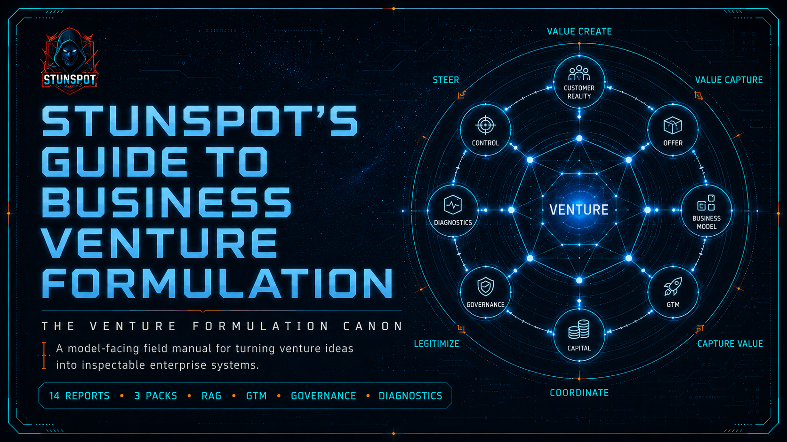

  

# Stunspot's Guide to Business Venture Formulation

**The Venture Formulation Canon**  
*A model-facing field manual for turning venture ideas into inspectable enterprise systems.*

*Stunspot's Guide to Business Venture Formulation* is a Markdown-native knowledge repository built primarily for AI/RAG ingestion, long-context reasoning, and structured venture-analysis workflows.

Its main audience is the model.

The docs here are the navigation layer. They orient human readers, AI assistants, RAG pipelines, project knowledge systems, and local knowledge tools toward the real corpus, which lives in `knowledge-packs/`:

- source reports in `knowledge-packs/by-report/`
- grouped upload packs in `knowledge-packs/compiled-packs/`
- full-corpus omnibus bundle in `knowledge-packs/omnibus/`

The canon treats venture formulation as a systems problem: define the enterprise object, discipline inference under uncertainty, understand customer and market reality, construct the offer and commercial motion, assemble resources and governance, diagnose failure, and create measurement artifacts that make the venture steerable.

---

## Start Here

- [Canon Map](./canon-map.md) — report sequence, volume structure, and conceptual progression.
- [How to Use This Canon](./how-to-use-this-canon.md) — workflows for humans, AI assistants, and RAG systems.
- [Knowledge Packs](./knowledge-packs.md) — which upload format to use and why.

---

## Corpus at a Glance

| Layer | Path | Count | Purpose |
|---|---|---:|---|
| Source reports | `knowledge-packs/by-report/` | 14 | Canonical individual reports for precise retrieval, citation, and editing. |
| Compiled packs | `knowledge-packs/compiled-packs/` | 3 | Recommended default upload format for most AI/RAG systems. |
| Omnibus | `knowledge-packs/omnibus/` | 1 | Complete one-file corpus for archival, local search, and robust long-context systems. |

---

## Use as AI Knowledge Substrate

This canon is designed to be useful when placed inside AI systems as structured knowledge. Possible uses include:

- loading compiled packs into an AI Project or custom assistant knowledge base
- indexing source reports into a RAG pipeline with report-level metadata
- attaching selected reports to venture-review, founder-coaching, strategy, or GTM workflows
- loading the omnibus into strong long-context sessions for whole-canon synthesis
- grounding agentic critique of business models, market assumptions, offer architecture, GTM motion, governance, and execution controls
- giving AI systems stable terminology for venture formulation instead of generic startup advice

For most uses, begin with the compiled packs. Use source reports when you need tighter retrieval boundaries or explicit source-level citation. Use the omnibus only when your tool handles large single-file knowledge sources cleanly.
